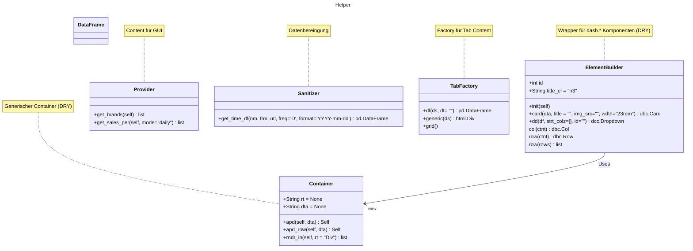
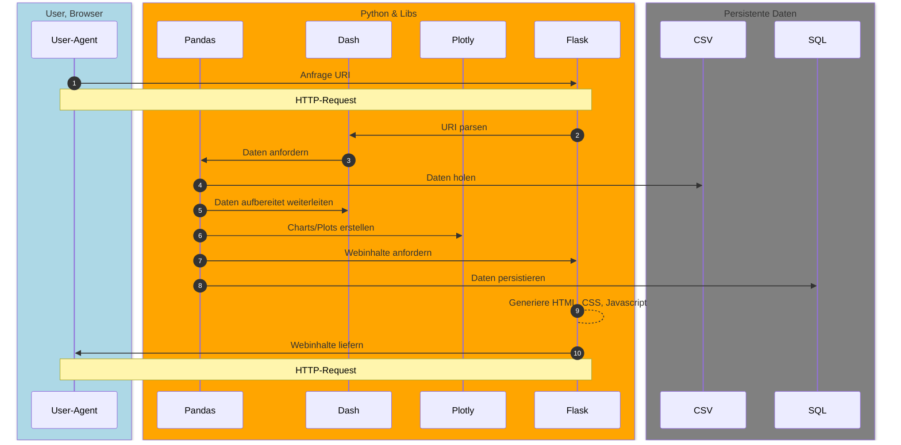

#  Data on the Rocks

## Package Whisky Tumbler Foo (wtf)

Package-Name für die selbst gecodeten Python-Scripte

- Verwendung von Helferklassen zur Vermeidung von (Boilerplate-) Code
- Datenbereinigungstools
- HTML-Generierung (<abbr title="Don't repeat yourself">DRY</abbr>)
- SQL-Generierung

### wtf.container

- Klasse, um (HTML-) Container zu verwalten und dem DRY-Prinzip Folge zu leisten

### wtf.provider

- Content für GUI managen

### wtf.sanitize

- Generische Klasse für die Datenbereinigung

### wtf.generic_elements

- Generische Klasse für die Erzeugung von HTML; DRY

### wtf.factory

- Factory für die Erzeugung von HTML; DRY

#### Klassendiagramm

## Architektur

### Multi-Tier-Modell Dash

