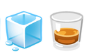
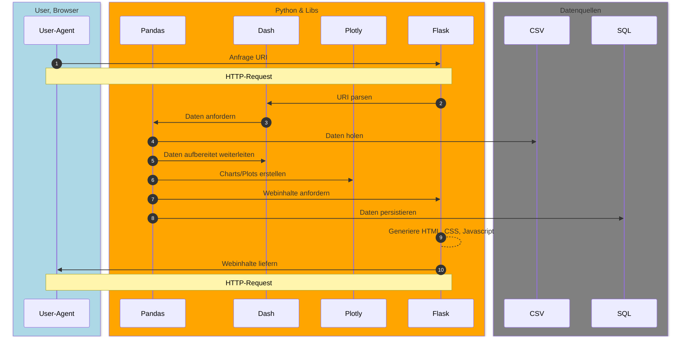

#  „Data on the rocks“

## Architketur

### Multi-Tier-Modell Dash

```mermaid
sequenceDiagram
autonumber
    
    box lightblue User, Browser
    participant User-Agent
    end

    box ORANGE  Python & Libs
    participant Pandas
    participant Dash
    participant Plotly
    participant Flask
    end

    box gray Datenquellen
    participant CSV
    participant SQL
    end
    
    User-Agent->>Flask: Anfrage URI
    Note over User-Agent, Flask: HTTP-Request
    
    Flask->>Dash: URI parsen
    Dash->>Pandas: Daten anfordern
    Pandas ->> CSV: Daten holen
    Pandas ->> Dash: Daten aufbereitet weiterleiten
    Pandas ->> Plotly: Charts/Plots erstellen
    Pandas ->> Flask: Webinhalte anfordern 
    Pandas ->> SQL: Daten persistieren 
    Flask --> Flask: Generiere HTML, CSS, Javascript
    
    Flask->>User-Agent: Webinhalte liefern
    Note over User-Agent, Flask: HTTP-Request
    

   
   
```

