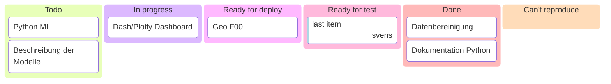

### Kanban Board

```mermaid
---
config: 
  kanban:
    ticketBaseUrl: 'https://gwen:8666/list/curr#TICKET#'
---
kanban
  Todo
    [Python ML]
    docs[Beschreibung der Modelle]
  [In progress]
    id6[Dash/Plotly Dashboard]
  id9[Ready for deploy]
    id8[Geo F00]
  id10[Ready for test]
    id66[last item]@{ priority: 'Very Low', assigned: 'svens' }
  id11[Done]
    id5[Datenbereinigung]
    id2[Dokumentation Python]

  id12[Can't reproduce]
```