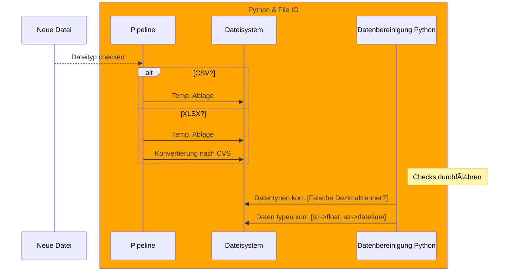

#  Whiskey on the Rocks

## Datenqualität

### Datenbereinigungs-Pipeline

```mermaid
sequenceDiagram
    participant inp as Neue Datei
    box ORANGE  Python &  File IO
    participant pipe as Pipeline
    participant fs as Dateisystem
    participant sanitizer as Datenbereinigung Python
    end 
    inp-->>pipe: Dateityp checken
     alt CSV?
            pipe->>fs: Temp. Ablage
     else XLSX?
            pipe->>fs: Temp. Ablage
            pipe->>fs: Konvertierung nach CVS
    end
    Note right of sanitizer: Checks durchführen
    sanitizer->>fs: Datentypen korr. [Falsche Dezimaltrenner?]
    sanitizer->>fs: Daten typen korr. [str->float, str->datetime]
    
    

    

```