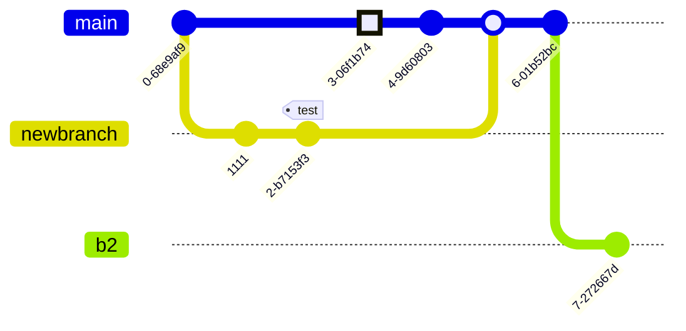

#  Whiskey on the Rocks

## Lines of Code
```
-------------------------------------------------------------------------------
Language                     files          blank        comment           code
-------------------------------------------------------------------------------
CSV                             13              0              0          11955
Python                           8             72             54            294
Text                             5              4              0            117
Jupyter Notebook                 5              0           1469             99
Markdown                         5             51              0             99
CSS                              1              3              0             19
-------------------------------------------------------------------------------
SUM:                            37            130           1523          12583

```
## Dateistruktur

```
├── Dashboards
│   ├── PowerBi
│   │   └── README.md
│   └── python
│       ├── LICENSE
│       ├── README.md
│       ├── Whiskyquartier_Rohdaten
│       │   ├── Aufschlüsselung der Conversion-Rate - 2024-08-31 - 2025-08-31.csv
│       │   ├── Gesamtumsatz im Zeitverlauf - 2024-08-31 - 2025-08-31.csv
│       │   ├── Gesamtumsatz nach Vertriebskanal - 2024-11-13 - 2025-08-31.csv
│       │   ├── Produkte nach Verkaufsrate - 2024-08-31 - 2025-08-31.csv
│       │   ├── Sitzungsverfolgung - Referrer nach Zeit, Sitzungsdauer und Aktionen - 2024-08-31 - 2025-08-31.csv
│       │   ├── dd.txt
│       │   ├── products.csv
│       │   ├── sales_per_channel.csv
│       │   └── sessions.csv
│       ├── __pycache__
│       │   └── dd.cpython-313.pyc
│       ├── app.py
│       ├── assets
│       │   ├── android-chrome-192x192.png
│       │   ├── android-chrome-512x512.png
│       │   ├── apple-touch-icon.png
│       │   ├── favicon-16x16.png
│       │   ├── favicon-32x32.png
│       │   ├── favicon.ico
│       │   ├── typography.css
│       │   └── whisk_rox.png
│       ├── dd.py
│       ├── ecomm.ipynb
│       ├── exporte
│       │   ├── cr.csv
│       │   ├── grube.txt
│       │   ├── mapping.txt
│       │   ├── sessions.csv
│       │   └── umsatz.csv
│       ├── new_app.py
│       ├── pages
│       │   ├── __pycache__
│       │   │   ├── products.cpython-313.pyc
│       │   │   ├── sales.cpython-313.pyc
│       │   │   ├── sessions.cpython-313.pyc
│       │   │   └── upload.cpython-313.pyc
│       │   ├── products.py
│       │   ├── sales.py
│       │   ├── sessions.py
│       │   └── upload.py
│       ├── read_cc.py
│       └── requirements.txt
├── Data
│   ├── Datensätze_roh
│   │   ├── Aufschlüsselung der Conversion-Rate - 2024-08-31 - 2025-08-31.csv
│   │   ├── Gesamtumsatz im Zeitverlauf - 2024-08-31 - 2025-08-31.csv
│   │   ├── Produkte nach Verkaufsrate - 2024-08-31 - 2025-08-31.csv
│   │   └── Sitzungsverfolgung - Referrer nach Zeit, Sitzungsdauer und Aktionen - 2024-08-31 - 2025-08-31.csv
│   ├── Produkte_bereinigt.csv
│   └── Sample_Datensätze
│       ├── Conversion-Rate
│       │   ├── Conversion-Rate_Sample.csv
│       │   └── cr_Skript.ipynb
│       ├── Gesamtumsatz
│       │   ├── Sample_Skript.ipynb
│       │   ├── Umsatz_Sample.csv
│       │   └── umsatz.ipynb
│       └── Sitzungsverfolgung
│           ├── Sitzungsverfolgung_Sample.csv
│           ├── Stizungsverfolgung_Skript.ipynb
│           └── Stzungsverfolgung_Beschreibung.txt
├── Documentation
│   ├── ArchitekturPython.md
│   ├── Projekt-Statistiken.md
│   ├── README.md
│   └── Setup_Install_Python.md
├── Eda
│   ├── Knime
│   │   └── README.md
│   └── Sql
│       └── README.md
├── README.md
├── Whiskyprojekt.knwf

```

