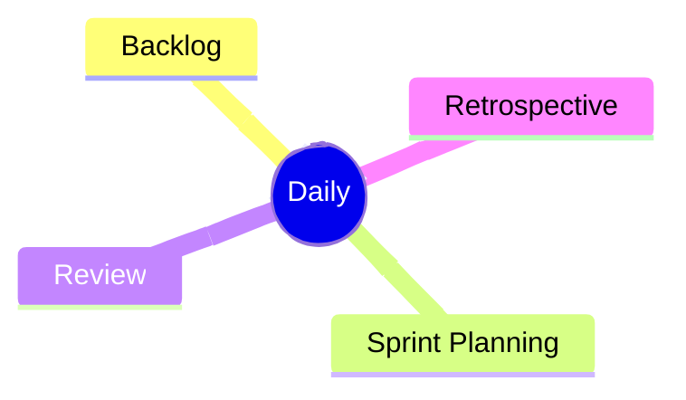
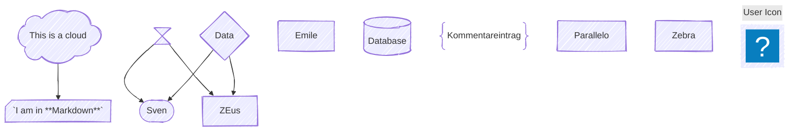
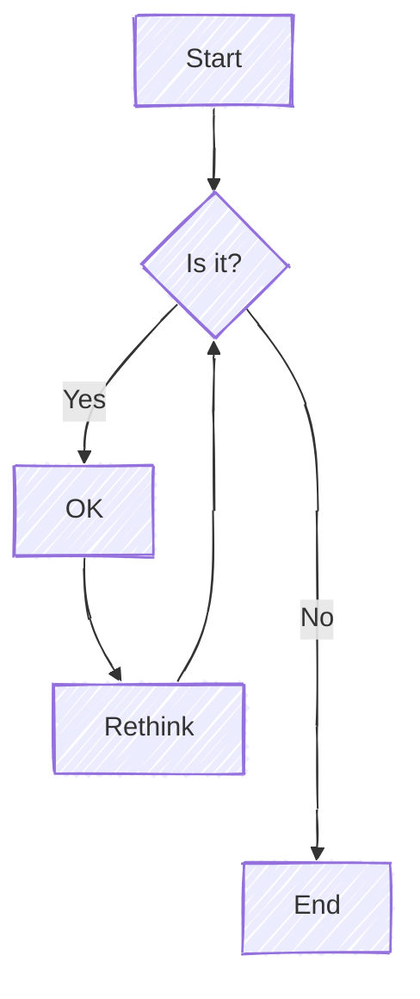

#  „Data on the rocks“

## Projektorganisation

### Scrum

```mermaid
---
config:
  look: handDrawn
  layout: cose-bilkent
---
mindmap
root((Daily))
  Backlog
  Sprint Planning
  Review
  Retrospective
```

```mermaid
---
config:
  look: handDrawn
  layout: dagre
---
flowchart TD
    A@{ shape: cloud, label: "This is a cloud" }
    B@{ shape: notch-rect, label: "`I am in **Markdown**`"}
    Claude@{ shape: collate, label: "Hourglass"}
    Data@{ shape: diam, label:"MAke a decision!"}
    Emile@{ shape:curv-trap, label:"Foo"}
    Frtz@{ shape: cyl, label: "Database" }
    Liza@{ shape: braces, label: "Kommentareintrag" }
    Parallelo@{ shape:st-rect, label:"Multitasking"}
    Sven@{ shape: stadium, label:"Foo"}
    Zebra@{ shape:tag-doc, label:"Volg"}
    Zeus@{ icon: "fa:user", form: "square", label: "User Icon", pos: "t", h: 60 }

    A-->B
    Claude & Data--> Sven & ZEus
```

```mermaid
---
config:
  look: handDrawn
  
---
flowchart TD
    A[Start] --> B{Is it?}
    B -->|Yes| C[OK]
    C --> D[Rethink]
    D --> B
    B ---->|No| E[End]
```