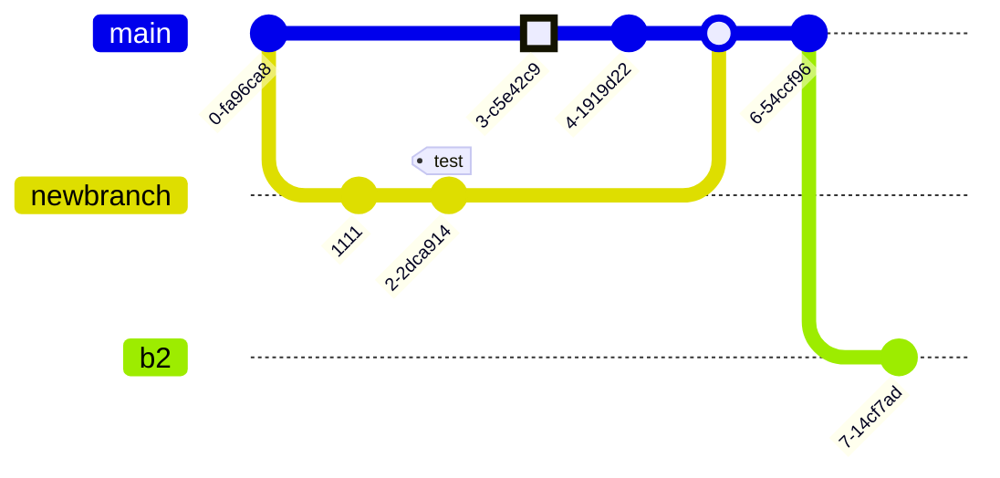

#  „Data on the rocks“

## Projekt-Statistiken

### Lines of Code

    
Anzeigen

<pre>

-------------------------------------------------------------------------------
Language                     files          blank        comment           code
-------------------------------------------------------------------------------
CSV                             58              0              0          31382
Python                          18            174            136            902
Markdown                        12            103              0            433
Jupyter Notebook                10              0           8264            264
Text                             7              4              0            226
SQL                              2             14              5             89
CSS                              3              5              0             55
-------------------------------------------------------------------------------
SUM:                           110            300           8405          33351
</pre>

### Dateistruktur

    
Dateien anzeigen

<pre>
├── Dashboards
│   ├── PowerBi
│   │   └── README.md
│   └── Python
│       ├── LICENSE
│       ├── README.md
│       ├── Test.ipynb
│       ├── Whiskyquartier_Rohdaten
│       │   ├── Aufschlüsselung der Conversion-Rate - 2024-08-31 - 2025-08-31.csv
│       │   ├── Gesamtumsatz im Zeitverlauf - 2024-08-31 - 2025-08-31.csv
│       │   ├── Gesamtumsatz nach Vertriebskanal - 2024-11-13 - 2025-08-31.csv
│       │   ├── Produkte nach Verkaufsrate - 2024-08-31 - 2025-08-31.csv
│       │   ├── Sitzungsverfolgung - Referrer nach Zeit, Sitzungsdauer und Aktionen - 2024-08-31 - 2025-08-31.csv
│       │   ├── dd.txt
│       │   ├── products.csv
│       │   ├── sales_per_channel.csv
│       │   └── sessions.csv
│       ├── __pycache__
│       │   ├── dd.cpython-313.pyc
│       │   └── factory.cpython-313.pyc
│       ├── app.py
│       ├── appy_n.py
│       ├── assets
│       │   ├── _typography.css
│       │   ├── android-chrome-192x192.png
│       │   ├── android-chrome-512x512.png
│       │   ├── apple-touch-icon.png
│       │   ├── favicon-16x16.png
│       │   ├── favicon-32x32.png
│       │   ├── favicon.ico
│       │   ├── typography.css
│       │   ├── typography_bak.css
│       │   └── whisk_rox.png
│       ├── dd.py
│       ├── dm_app.py
│       ├── ecomm.ipynb
│       ├── exporte
│       │   ├── cr.csv
│       │   ├── grube.txt
│       │   ├── mapping.txt
│       │   ├── sessions.csv
│       │   └── umsatz.csv
│       ├── factory.py
│       ├── foo.py
│       ├── new_app.py
│       ├── output
│       │   ├── 7bb991-55.csv
│       │   ├── ads_all.csv
│       │   ├── all.csv
│       │   ├── all_sorted.csv
│       │   ├── alphabet.csv
│       │   ├── cr.csv
│       │   ├── cr_new.csv
│       │   ├── cr_newest.csv
│       │   ├── cr_roh_kum.csv
│       │   ├── direct.csv
│       │   ├── duckduckgo.csv
│       │   ├── fb werbung.csv
│       │   ├── force.csv
│       │   ├── good-apps.csv
│       │   ├── linkedin.csv
│       │   ├── meta-sitelink-2.csv
│       │   ├── meta.csv
│       │   ├── microsoft.csv
│       │   ├── monat_sales_chann.csv
│       │   ├── monat_sales_chann_order_sales.csv
│       │   ├── monthly_sales_channel.csv
│       │   ├── office.csv
│       │   ├── sales_per_channel.csv
│       │   ├── shopify.csv
│       │   ├── spiritradar.csv
│       │   ├── syndicatedsearch.csv
│       │   ├── umsatz.csv
│       │   ├── umsatz_last.csv
│       │   ├── umsatz_last1.csv
│       │   ├── umsatz_neu.csv
│       │   ├── whiskybase.csv
│       │   └── whiskystats.csv
│       ├── pages
│       │   ├── __pycache__
│       │   │   ├── ads.cpython-313.pyc
│       │   │   ├── products.cpython-313.pyc
│       │   │   ├── sales.cpython-313.pyc
│       │   │   ├── sessions.cpython-313.pyc
│       │   │   ├── test.cpython-313.pyc
│       │   │   └── upload.cpython-313.pyc
│       │   ├── ads.py
│       │   ├── products.py
│       │   ├── sales.py
│       │   ├── sessions.py
│       │   ├── test.py
│       │   └── upload.py
│       ├── read_cc.py
│       ├── requirements.txt
│       ├── sw_app.py
├── Data
│   ├── Datensätze_roh
│   │   ├── Aufschlüsselung der Conversion-Rate - 2024-08-31 - 2025-08-31.csv
│   │   ├── GU Vertriebskanal Monate.csv
│   │   ├── Gesamtumsatz im Zeitverlauf - 2024-08-31 - 2025-08-31.csv
│   │   ├── Gesamtumsatz nach Vertriebskanal - 2024-10 - 2025-08.csv
│   │   ├── Gesamtumsatz nach Vertriebskanal - 2024-11-13 - 2025-08-31.csv
│   │   ├── GoogleAds.csv
│   │   ├── Kopie-Aufschlüsselung der Conversion-Rate - 2024-08-31 - 2025-08-31.csv
│   │   ├── MetaAds.csv
│   │   ├── Produkte nach Verkaufsrate - 2024-08-31 - 2025-08-31.csv
│   │   ├── Produkte_bereinigt.csv
│   │   └── Sitzungsverfolgung - Referrer nach Zeit, Sitzungsdauer und Aktionen - 2024-08-31 - 2025-08-31.csv
│   ├── Sample_Datensätze
│   │   ├── Conversion-Rate
│   │   │   ├── Conversion-Rate_Sample.csv
│   │   │   └── cr_Skript.ipynb
│   │   ├── Gesamtumsatz
│   │   │   ├── Sample_Skript.ipynb
│   │   │   ├── Umsatz_Sample.csv
│   │   │   └── umsatz.ipynb
│   │   └── Sitzungsverfolgung
│   │       ├── Sitzungsverfolgung_Sample.csv
│   │       ├── Stizungsverfolgung_Skript.ipynb
│   │       └── Stzungsverfolgung_Beschreibung.txt
│   ├── Sanitized
│   │   ├── Agg.csv
│   │   ├── Alpha_agg.csv
│   │   ├── Alpha_s.csv
│   │   ├── Meta_agg.csv
│   │   ├── Meta_s.csv
│   │   ├── sessions.csv
│   │   ├── sorted_agg.csv
│   │   └── tmp
│   │       ├── Meta.csv
│   │       └── MetaAds-Kampagnen.xlsx
│   ├── first_look.sql
│   └── main.db
├── Documentation
│   ├── Architektur_Python.md
│   ├── Change_History.md
│   ├── Data_Quality.md
│   ├── Ecomm
│   │   ├── Cheat_Sheet.md
│   │   └── KPI.md
│   ├── Projekt_Orga_Scrum.md
│   ├── Setup_Install_Python.md
│   ├── Statistiken.md
│   └── Tech_Python
│       └── DD.txt
├── Eda
│   ├── Knime
│   │   ├── 250926_Median+Mean_cr_KPIs.knwf
│   │   ├── README.md
│   │   ├── Whiskyprojekt.knwf
│   │   └── umsatz-prediction-endversion.knwf
│   ├── Python
│   │   ├── Ads.ipynb
│   │   ├── Sanitizing.ipynb
│   │   └── sanitizer.py
│   ├── README.md
│   └── Sql
│       ├── README.md
│       └── tmp_table.sql
├── ML_Models
│   ├── Playground.ipynb
│   └── tmp
│       └── 13_Skript_Einfache_Lineare_Regression_ausgefuellt.ipynb
├── README.md
├── current_venv.txt
├── grube.py
├── grube.txt

</pre>

## Git History (exemplarisch)

Anzeigen

