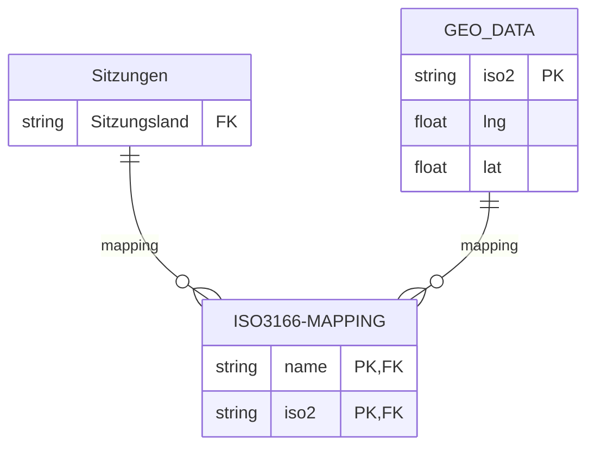

# SBA
## Tooling

### Knime (First look, EDA & Data Partitioning)

### Python 3.13 

Die Verwendung von Python umfasst die folgenden Aufgabenbreiche:

- First-Look
- EDA 
- Grafische Datenanalyse
- Dashboard(s)
- Admin-Tool (Import neuer Daten, Definition von KPIs, Diagrammwahl)
- Export der Daten (mit Filter-, Sortierkriterien) nach:
    - SQL
    - CSV
    - XML

Hierzu wurden neben der Verwendung der erwähnten Bibliotheken (Numpy, Pandas, PX, Dash) diverse Helferklassen erstellt [(im Package WhiskyTeleFoo: ```wtf```)](../Dashboards/python/wtf/README.md)

### SQL 

- RDBMS: Postgres,  SQLite und generisches SQL

Aus den "Rohdaten" wird (via Python) eine Extraktion der Daten vorgenommen und diese in ein normalisiertes relationales Datenmodell überführt.

Die Daten werden in eine lokale PostreSQL- und Sqlite- Instanz übernommen und als generisches SQL- (DDL, DML) Schema
ablegt, sodass eine Übernahme in andere RDBMS möglich ist.

Somit werdn eine schnelle Auswertungen, (Views, Aggregationen, etc.) sowie ein Export der Daten zu jedem Zeitpunkt ermöglicht.

## Externe Datenquellen

Zur Visulalisierung der geografischen Verteilung der Sitzungen wurden folgende Resourcen benutzt:

- [ISO 3166 Mapping](https://www.kaggle.com/datasets/wbdill/country-codes-iso-3166) 
- [Lng/Lat - Mapping](https://simplemaps.com/data/world-cities)


### Geo-Mapping

